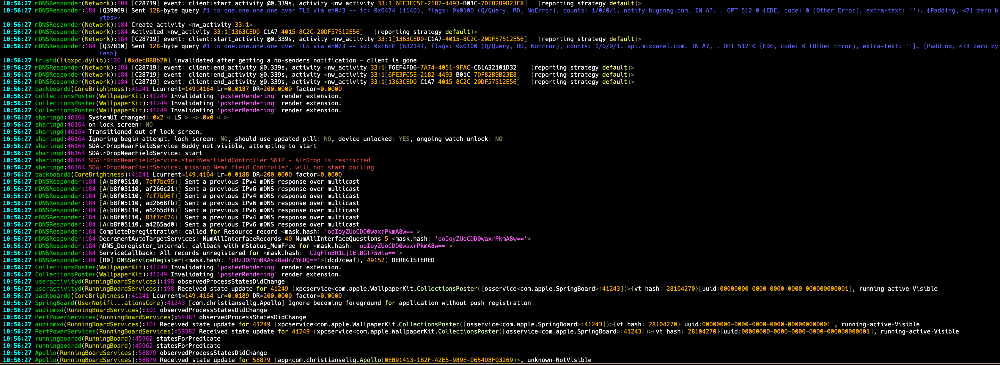
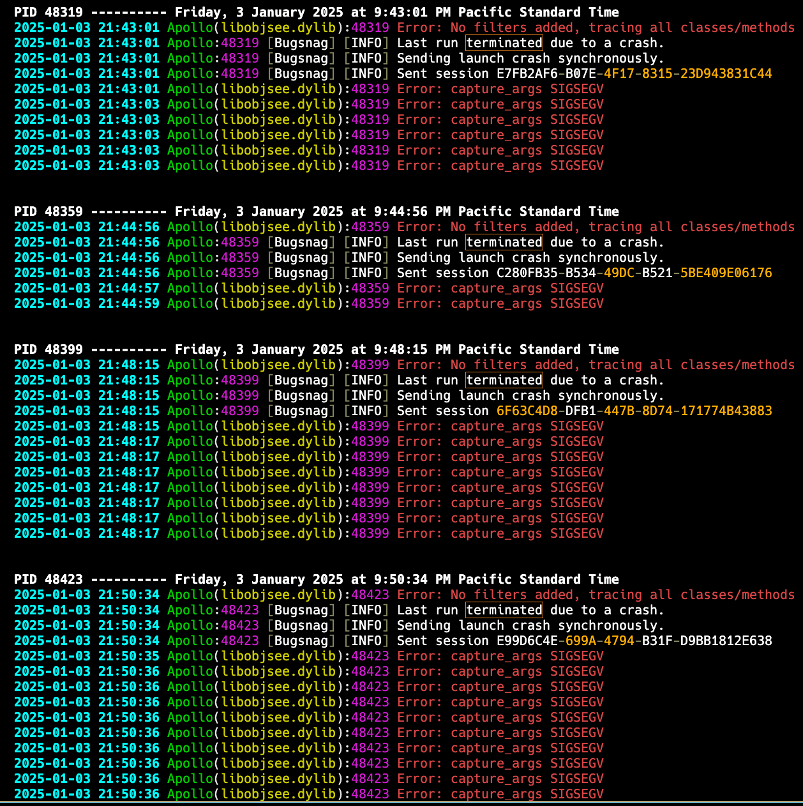

# oslo

An `os_log` viewer for iOS that supports streaming both real-time logs and archived logs.

- Real-time and archived log viewing
- Unredacts `<private>` values in log messages
- Advanced filtering by process name, PID, and content with inclusion/exclusion rules
- Time-based filtering
- Syntax highlighting
- Process grouping
- JSON output support

### Usage

```
oslo [process] [filters] [options]

Process:
  <name>         Process name (case insensitive substring match))
  <pid>          Process ID
                 (shows all processes if omitted)

Filters:
  -L, --level    Log level (debug|info|warn|error)
  -a, --after    Time format options:
                   Offset: -1h, -30m, -1d, -1w
                   Date: 2025-01-23
                   Time: 12:34:56
                   Both: 2025-01-23 12:34:56
  -b, --before   Same time formats as --after
  -c, --contains Include messages containing text (case insensitive)
  -e, --exclude  Exclude messages containing text (case insensitive)

Options:
  -l, --live     Live logs (default)
  -s, --stored   Stored logs
  -g, --group    Group by process
  -j, --json     JSON output
  -f, --file     Write to file
  -r, --repeats  Drop repeated messages (default: show all)
```

#### Usage Examples

```bash
# Stream all live logs
oslo

# View SpringBoard logs
oslo springboard

# View stored logs from process ID 1234
oslo -s 1234

# View error logs from Notes app in the last hour
oslo notes --level=error --after=-1h

# View stored crash-related logs, grouped by PID
oslo -s -g --contains=crash

# Export filtered logs to file
oslo springboard --level=error --file=errors.log

# Get JSON output for automation
oslo notes --json > notes_logs.json
```

### Requirements

* Jailbroken iOS 14.0 or later
  * Earlier versions may work. iOS 14.0 - 18.2 tested
  * Rootless or rootful
* Pre-compiled releases include armv7, armv7s, and arm64 slices

### Screenshots

#### Live log streaming


#### Stored logs grouped by PID


#### Demo
[](https://asciinema.org/a/tet26ugcwutH0CIwjKeS99C1P?poster=npt:07)

## Credits

* [Theldus](https://github.com/Theldus) for the [kat syntax highlighting](https://github.com/Theldus/kat/tree/master) library